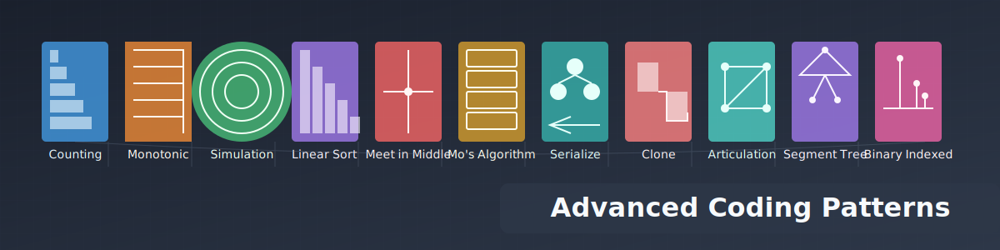

# Advanced Coding Interview Patterns Platform - Technical Documentation
**URL**: [https://acip.vercel.app/](https://acip.vercel.app/)


## Table of Contents

1. [Architecture Overview](#architecture-overview)
2. [Frontend Architecture](#frontend-architecture)
3. [State Management](#state-management)
4. [Routing and Navigation](#routing-and-navigation)
5. [Data Management](#data-management)
6. [Component Structure](#component-structure)
7. [Animation System](#animation-system)
8. [Performance Optimizations](#performance-optimizations)
9. [Testing Strategy](#testing-strategy)
10. [Deployment and CI/CD](#deployment-and-cicd)
11. [Future Enhancements](#future-enhancements)

## 0. Project Overview
- The project is a front-end application built with Vite.
- It consists of two main pages: index and patterndetails.
- The index page displays 11 patterns.
- Clicking on a pattern leads to the patterndetails page.
- The patterndetails page shows subpatterns.
- Clicking on a subpattern creates a dropdown effect (similar to neetcode.io).
- Each subpattern contains 3-5 questions.

## 1. Architecture Overview

The Advanced Coding Interview Patterns Platform is built on a modern, scalable architecture designed to provide a seamless and interactive learning experience. The application is primarily client-side rendered, leveraging the power of React and Next.js for optimal performance and SEO benefits.

### Key Architectural Decisions:

- **Frontend**: React with Next.js (App Router) for efficient client-side rendering and easy server-side rendering when needed.
- **Styling**: Tailwind CSS for a utility-first approach, enabling rapid UI development and easy maintenance.
- **State Management**: React Hooks and Context API for local and global state management, avoiding unnecessary complexity.
- **Routing**: Next.js App Router for file-system based routing, enabling easy management of dynamic routes.
- **Data Fetching**: Static Site Generation (SSG) for pattern data, combined with client-side data fetching for user-specific information.
- **Animations**: Custom SVG-based animations using React components for interactive learning experiences.

## 2. Frontend Architecture

The frontend is built using React 18 and Next.js 13, taking advantage of the latest features and optimizations.

### Key Components:

- **Next.js App Router**: Utilized for its file-system based routing and built-in optimizations.
- **React 18**: Leveraging concurrent rendering and automatic batching for improved performance.
- **Tailwind CSS**: For responsive design and consistent styling across the application.

### Code Structure:

```
# Advanced Coding Interview Patterns (ACIP)

src/
├── components/
│   ├── Banner.tsx                           # Page 1: Header Component
│   ├── DifficultyBadge.tsx                 # Shared: Shows difficulty level
│   ├── ErrorBoundary.tsx                   # Shared: Error handling wrapper
│   ├── PatternCard.tsx                     # Shared: Card component for patterns
│   ├── footer.tsx                          # Shared: Footer component
│   ├── patterns/
│   │   ├── index-page-components/          # Page 1: Main landing page components
│   │   │   ├── PatternGrid.tsx            # Grid layout of pattern cards
│   │   │   └── StatisticsSection.tsx      # Statistics display section
│   │   └── pattern-detail-components/      # Page 2: Pattern detail components
│   │       ├── PatternHeader.tsx          # Header for pattern details
│   │       └── questions-list/            # Questions section components
│   │           ├── QuestionsList.tsx      # Entry point - manages questions data
│   │           ├── Question.tsx           # Individual question component
│   │           ├── Subpattern.tsx        # Subpattern section component
│   │           ├── PatternSummary.tsx     # Pattern summary section
│   │           ├── QuestionDetails.tsx    # Detailed question view
│   │           └── AnimationDialog.tsx    # Animation modal component
│   ├── ui/                                 # Shared UI components
│   │   ├── button.tsx
│   │   ├── dialog.tsx
│   │   └── card.tsx
│   └── layout.tsx                          # Main layout wrapper
├── pages/                                  # Main application pages
│   ├── index.tsx                          # Page 1: Landing page
│   └── PatternDetail.tsx                   # Page 2: Pattern details page
├── data/
│   ├── types.ts                           # Type definitions for patterns & components
│   └── patterns/                          # Pattern definitions and data
│       ├── index.ts                       # Entry point for patterns
│       ├── pattern-mapping.ts             # Pattern path mappings
│       ├── visualizers-registry.ts        # Animation visualizers registry
│       ├── counting-pattern/              # Example pattern
│       │   ├── counting-pattern.ts        # Pattern definition
│       │   └── animations/                # Pattern animations
│       │       ├── index.ts               # Entry point for animations
│       │       └── basic-counting/        # Subpattern animations
│       │           ├── data.ts            # Animation data
│       │           └── visualizer.tsx     # Animation component
│       ├── articulation-points-and-bridges-pattern/
│       │   ├── articulation-points-pattern.ts
│       │   └── animations/
│       │       ├── index.ts
│       │       └── [subpattern-folders]/
│       │           ├── data.ts
│       │           └── visualizer.tsx
│       └── serialize-deserialize-pattern/
           ├── serialize-deserialize-pattern.ts
           └── animations/
               ├── index.ts
               └── [subpattern-folders]/
                   ├── data.ts
                   └── visualizer.tsx
└── lib/
    └── utils.ts                           # Utility functions
```
### Key Features of the Project Structure:

1. Next.js App Router: Utilizes file-system based routing (`pages/` directory).
2. React Hooks and Context API: Used for local and global state management.
3. Tailwind CSS: Employed for styling and responsive design.
4. Static Data: Pattern data stored in `data/patterns/` for Static Site Generation.
5. Animations: Custom SVG-based animations for each pattern/subpattern.
6. Performance Optimizations: Implements code splitting, lazy loading, and memoization.
7. Shared UI Components: Leverages shadcn/ui library in the `components/ui/` directory.

## 3. State Management

The application uses a combination of local component state and global application state managed through React's Context API and custom hooks.

### Global State:

- **User Progress**: Tracks completed questions and pattern progress.
- **Theme**: Manages light/dark mode preferences.

### Local State:

- Component-specific state (e.g., form inputs, UI toggles) is managed using the `useState` hook.

### Custom Hooks:

- `usePatternProgress`: Manages and persists user progress for each pattern.
- `useAnimation`: Controls the state and flow of pattern animations.

## 4. Routing and Navigation

Routing is handled by Next.js App Router, providing a seamless, single-page application experience with the benefits of server-side rendering when necessary.

### Key Routes:

- `/`: Home page with the pattern grid
- `/pattern/[id]`: Dynamic route for individual pattern pages

### Navigation Optimizations:

- Prefetching of linked pages for instant navigation
- Shallow routing for updating URL parameters without full page reloads

## 5. Data Management

### Pattern Data:

- Stored as static TypeScript files in the `data/patterns` directory.
- Leverages Next.js's Static Site Generation for optimal loading performance.

### User Progress Data:

- Stored in browser's localStorage for persistence across sessions.
- Synced with a backend service (future enhancement) for cross-device accessibility.

## 6. Component Structure

The application follows a modular component structure, promoting reusability and maintainability.

### Key Components:

- `PatternGrid`: Displays the grid of available patterns on the home page.
- `QuestionsList`: Renders the list of questions for each pattern, including subpatterns.
- `AnimationDialog`: Presents interactive animations for each subpattern.

### Shared UI Components:

- Leverages the `shadcn/ui` component library for consistent and accessible UI elements.

## 7. Animation System

A custom animation system is implemented to provide interactive visualizations for each subpattern.

### Architecture:

- Each animation is encapsulated in its own React component.
- Animations are driven by a state machine, allowing for step-by-step progression and interactivity.

### Key Features:

- SVG-based rendering for crisp visuals at any scale.
- Responsive design, adapting to different screen sizes.
- Accessibility considerations, including keyboard navigation and screen reader support.

## 8. Performance Optimizations

Several strategies are employed to ensure optimal performance:

- **Code Splitting**: Utilizes Next.js's automatic code splitting for reduced initial load times.
- **Lazy Loading**: Components and animations are lazy-loaded using React's `Suspense` and `lazy`.
- **Memoization**: React's `useMemo` and `useCallback` hooks are used to optimize expensive computations and prevent unnecessary re-renders.
- **Virtual Scrolling**: Implemented for long lists of questions to improve rendering performance.

## 9. Testing Strategy

A comprehensive testing strategy is implemented to ensure reliability and ease of maintenance:

- **Unit Tests**: Jest for testing individual components and utility functions.
- **Integration Tests**: React Testing Library for testing component interactions.
- **E2E Tests**: Cypress for full end-to-end testing of critical user flows.
- **Visual Regression Tests**: Percy for catching unintended visual changes.

## 10. Deployment and CI/CD

The application is deployed using a robust CI/CD pipeline:

- **Version Control**: Git with GitHub for source code management.
- **CI/CD**: GitHub Actions for automated testing and deployment.
- **Hosting**: Vercel for seamless deployment and serverless functions support.
- **Environment Management**: Use of environment variables for managing different deployment stages (development, staging, production).

## 11. Future Enhancements

Planned technical enhancements to further improve the platform:

- Implementation of a backend API for user authentication and progress syncing across devices.
- Integration of machine learning algorithms to provide personalized question recommendations.
- Development of a mobile app using React Native for cross-platform support.
- Implementation of WebAssembly for high-performance animations and simulations.

This technical documentation provides a comprehensive overview of the Advanced Coding Interview Patterns Platform, showcasing its robust architecture, performance optimizations, and forward-thinking design. The combination of modern web technologies, thoughtful architecture, and focus on user experience positions this platform as a cutting-edge solution for coding interview preparation.
